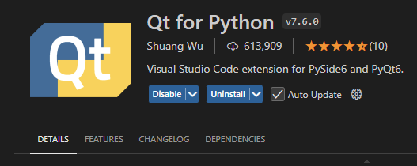

# 01. Introduction

### PySide6이란?

C++ 기반의 Qt Framework를 Python으로 사용할 수 있도록 제공되는 API

- Python 으로 코드를 작성
- 실제 동작 시에는 대응되는 C++ 기반 Qt 기계어 코드가 수행됨

---

### Qt

Qt에서 개발한 UI 개발을 위한 framework

- 크로스 플랫폼
- Windows, MacOS, Linux 등 하나의 코드로 application 을 개발할 수 있음

---

### PySide vs. PyQt

사용방법은 거의 동일함

PyQt : Riverbank Computing 에서 출시
- GPL : 개발한 소스코드의 공개 의무

PySide : The Qt Company 에서 (뒤늦게) 출시
- LGPL : 라이브러리만 연결해서 사용하는 경우에는 소스코드의 공개하지 않아도 됨. 따라서 상업적 목적의 개발에서 유리

---
### pyside6 설치

- Anaconda 설치
  - https://www.anaconda.com/download
  - Anaconda powershell prompt 로 열기
  
- python 3.10 버전의 가상환경 생성
```bash
conda create --name py310 python=3.10
```

- 가상환경 활성화
```bash
conda activate py310
```

- pyside6 설치

```bash
pip install pyside6
```

---

### 개발 환경 설정

본인에게 편한 IDE(통합개발환경)을 사용하면 됨.

Visual Studio Code 추천

- Qt for Python 확장프로그램 설치



- python debugger 선택 (우측 하단)

