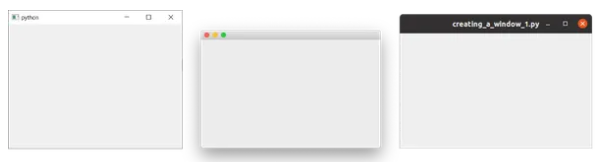
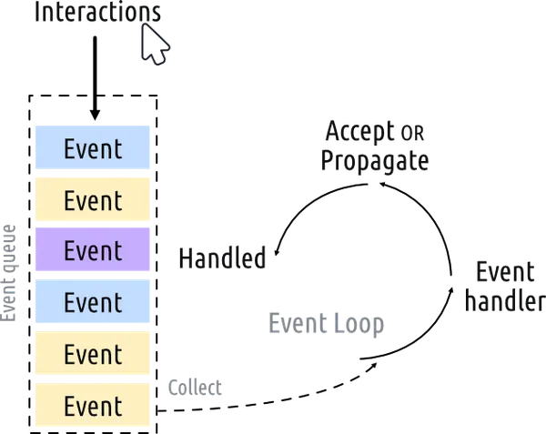

# 02. Creating first app with PySide6

첫번째 파일을 생성한 후, 소스코드 입력

```python
from PySide6.QtWidgets import QApplication, QWidget

import sys

app = QApplication(sys.argv)

window = QWidget()
window.show() 

app.exec()
```

### 실행

- Command Line 에서 python app.py 입력

- Visual studio code 에서 Run with Debugging (Ctrl+F5) 입력

### 결과 확인



---

### 코드 설명

sys.argv 는 Command Line 에서 인자를 넘겨받을 수 있게 함

- 별도 인자를 입력할 필요가 없는 경우, `Qapplication([])` 으로 입력 가능

- QWidget() : 가장 기본적인 윈도우 창. 비어있음.

- window.show() : widget 은 기본적으로 숨겨져있으므로, show 처리를 해주어야 함

- app.exec() : 이벤트루프를 시작하는 부분

### Event Loop

키를 누르거나, 마우스를 클릭하거나, 마우스를 움직이는 등 애플리케이션과의 모든 상호작용은 Event Queue 에 들어감.

Event Loop 는 Queue 를 확인하고 대기 중인 이벤트가 있으면 Event Handler 로 전달하여 처리함.

애플리케이션 (QApplication) 당 Event Loop 는 하나만 존재 함.



---

### QMainWindow

QWidget 대신 QMainWindow 를 사용해보기

- 결과 : 동작은 동일함

QMainWindow 를 하위 클래스로 만들어서 관리하여 사용자 지정 창을 만들고 관리할 수 있음

```python
import sys

from PySide6.QtCore import QSize, Qt
from PySide6.QtWidgets import QApplication, QMainWindow, QPushButton

class MainWindow(QMainWindow):
    def __init__(self):
        super().__init__()
        self.setWindowTitle("My App")
        button = QPushButton("Press Me!")
        self.setCentralWidget(button)

app = QApplication(sys.argv)

window = MainWindow()
window.show()

app.exec()
```

### 코드설명

QMainWindow 를 상속받는 MainWindow 클래스 생성

QMainWindow 가 원래 수행하는 객체 설정을 그대로 수행할 수 있도록 생성자 (`__init__`) 내부에 super() 의 생성자를 수행함

setWindowTitle : 창의 이름 설정

QPushButton : 버튼 추가

setCentralWidget : 창의 중앙에 오도록 설정

### Window 와 Widget 크기 조정

객체의 크기는 QSize 를 활용하여 설정하며, 가로 - 세로 순서를 따름.

클래스를 아래와 같이 변경해본 뒤, 창의 크기를 확인해보자.

```python
class MainWindow(QMainWindow):
    def __init__(self):
        super().__init__()
        self.setWindowTitle("My App")
        button = QPushButton("Press Me!")

        self.setFixedSize(QSize(400, 300))
        
        self.setCentralWidget(button)
```

setFixedSize : 창 크기를 변경할 수 없게 강제함


