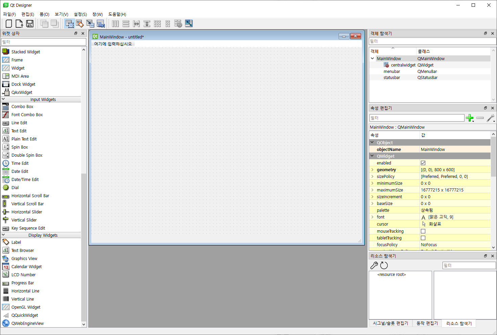
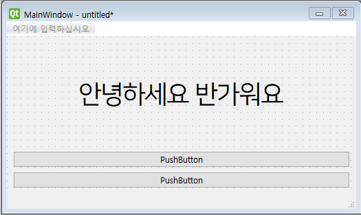
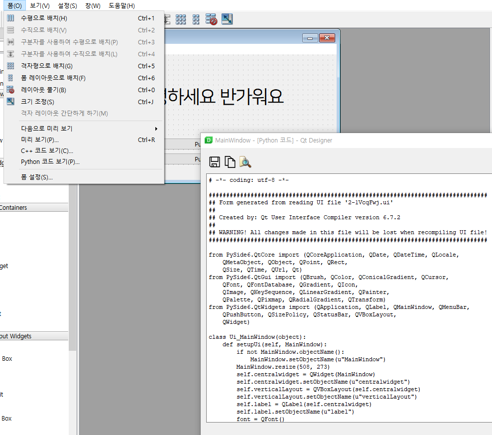

# 01. First qt designer app

지금까지 python 코드를 사용하여 앱을 만들어보았다. 애플리케이션의 규모가 커지거나 인터페이스가 복잡해지면 모든 위젯을 하드코딩하여 관리하는 것은 큰 부담이 될 수 있다.

Qt 가 제공하는 드래그앤드롭 방식의 UI Editor 인, Qt Designer 를 활용하면 이러한 작업을 훨씬 효율적으로 수행할 수 있다. WYSIWYG (What You See Is What You Get, 위지위그) Tool이며, TkInter 등의 다른 Python GUI Library보다 Qt가 많이 사용되는 강점 중의 하나이다.

그럼, 기존에 코드로 배운 내용은 효과가 없는가? 전혀 아니다. 기본적인 원리, 레이아웃, 위젯의 개념은 동일하게 적용할 수 있고, Qt Designer 를 통해 나온 코드에서 수정해야할 일들도 발생하므로 코드 역시 볼 수 있어야겠다.

### Qt Designer 의 실행

pyside6 을 설치하였으면, 자동으로 Qt Designer 역시 설치되어있는 상태일 것이다.

pyside6 이 설치된 가상환경의 Command line 에 아래와 같이 입력하면 실행이 된다.

```bash
> conda activate py310
> pyside6-designer
```

Main Window 를 설정하고 실행한다.


아래의 화면이 가장 기본적인 편집 화면이다.



아래와 같은 세로 3단으로 구성되어있다.
- 좌측 : 레이아웃과 위젯이며, 중앙으로 드래그앤드롭할 수 있다.
- 중앙 : 편집하고자 하는 Window 가 표시된다.
- 우측 : 선택한 객체에 대한 세부 정보와 속성을 편집할 수 있다. 객체 탐색기에서는 위젯, 레이아웃, 창 사이의 부모자식 관계를 볼 수 있다.


### 유용한 기능

- Ctrl + R 미리보기


### 실습

Label, Pushbutton, Layout, 정렬, Font 등을 활용해서 다음 화면을 구현해보자




---

### Qt Designer 의 결과물을 프로젝트로 가져오기

1. 작업한 내용을 ui 파일로 저장

2. ui 파일을 작업 폴더로 가져오기
    - ui 파일을 처리하기 위해서는 2가지 방법이 있다.
        - .loadUI() method 를 통해 클래스에 로드하기
        - pyside6-uic 를 통해 python 코드로 변환하기
    
### 1. ui 파일을 로드하여 사용

QUiLoader 를 활용하는 방법이다.

```python
import sys
from PySide6 import QtWidgets
from PySide6.QtUiTools import QUiLoader

loader = QUiLoader()

def mainwindow_setup(w):
    w.setWindowTitle("MainWindow Title")

app = QtWidgets.QApplication(sys.argv)

window = loader.load("mainwindow.ui", None)
mainwindow_setup(window)
window.show()
app.exec()
```


### 2. uic 로 python 으로 변환하여 사용



창에 표기 되는 모든 소스코드를 복사하고, 그 하단에 아래 코드를 추가한다.

```python

class MainWindow(QMainWindow, Ui_MainWindow):

    def __init__(self):
        super().__init__()
        self.setupUi(self)             

app = QApplication([])
w = MainWindow()
w.show()
app.exec()
```

QMainWindow와 Ui_MainWindow 를 같이 상속받는 클래스를 만들고, setupUi method 를 통해 UI 를 그린다.

위 처럼 구현하지 않고, 별도의 파일로 구성하여 아래처럼 import 하는 방식도 가능하다.


```python
from MainWindow import Ui_MainWindow
```

### 정리

두 가지 방법 중 어떤 것이 더 좋은지는 전적으로 개발자의 성향에 달려있다.

Qt Designer 에서 수정 작업이 많은 경우에는 python  코드 복붙이 없는 전자를 선호할 수 있다.

모든 코드가 python 으로 관리되는 것이 안정적이라는 생각이 드는 사람은 후자를 선호한다. 다만, Qt Designer로 UI를 수정할 때마다 코드를 다시 생성해야 한다는 단점이 있다.