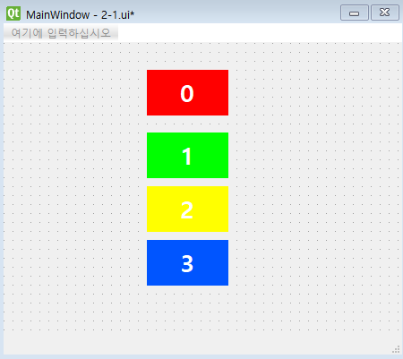
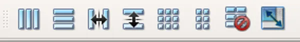

# 02. Layout

앞에서도 몇 가지 Layout 을 살펴보았지만, 이번 장에서는 Toolbar 를 활용해본다.

### Layout 처리될 요소 추가하기

직관적으로 layout 처리를 관찰하기 위해 색깔이 서로 다른 위젯을 만든다.

1. label 을 끌어온다.

2. 속성편집기의 text 에서 우측 ... 을 눌러서 텍스트 편집기를 띄운다.

3. 입력할 숫자, Font, 색깔을 입력한다.

4. 속성편집기의 autoFillBackground 에 체크를 활성화한다.

5. 속성편집기의 palette 를 누른 후, 빠른 설정에서 색깔을 설정한다.

6. 다른 색깔에 대해서도 추가하여 아래와 같이 만든다.

---

### Layout 적용

1. 수평으로 배치

2. 수직으로 배치

3. 구분자를 기준으로 수평으로 배치 (사용자는 애플리케이션에서 구분자를 조정할 수 있음)

4. 구분자를 기준으로 수직으로 배치

5. 그리드 배치

6. Form Layout : 입력폼에 맞는 레이아웃으로 구성

7. Layout 요소를 없앤다. 이것이 적용되면, 위젯을 개별적으로 이동하거나 크기를 조정할 수 있음.

8. 크기 조정 : 위젯을 모두 포함하고 각 위젯이 표시될 수 있는 충분한의 공간을 확보하도록 레이아웃의 크기를 조절함

### Layout 실습

1. 4개의 UI 를 선택 후 여러 layout 을 눌러보기

2. layout 해제해보기

3. 크기 조정 기능을 활용해보기

4. 3개의 UI 에 layout 을 설정하고, 나머지 1개 UI 를 배치해보기

### Splitter 사용법

1. Splitter 를 사용하기 위해서는 layout 에 배치되지 않은 2가지 UI 를 선택한다. (Ctrl 을 누른 상태에서 마우스 클릭 하면 여러 UI 를 선택할 수 있다.)

2. 그 후 QSplitter toolbar 를 누른다.

3. 미리보기 (Ctrl + R) 이후 Splitter 를 조절해본다.

### 주의

- 최상위 레이아웃의 경우, 객체 탐색기에 표시되지 않는다는 점에 유의

- 레이아웃이 존재하지 않으면, 창 크기를 조정할 때 위젯 크기가 자동으로 조정되지 않음 (반응형)

