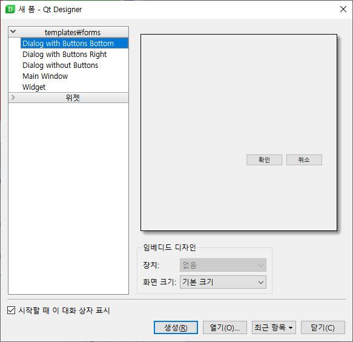
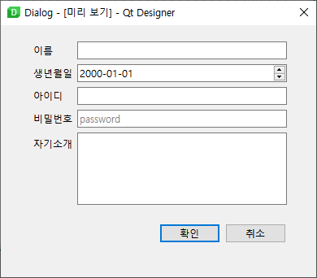
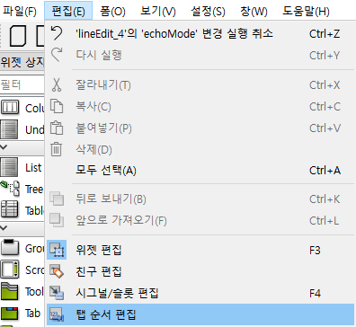

# 03. Dialog

이번 장에서는 Qt Designer 를 통해 대화상자 (다이얼로그, dialog)를 다뤄본다.

대화상자는 새 Form 에서 선택할 수 있으며, 기본 버튼이 있는 형태를 지정할 수 있다.

### 실습 : 회원 가입

간단히 이름, 생년월일, 아이디, 비밀번호, 자기소개 정보를 받을 수 있는 대화상자를 아래와 같이 구현해보자.

- 비밀번호의 경우, Line Edit 를 활용하는 것은 동일하지만 echoMode 를 Password 로 설정하면 됨

- 효과적인 배치를 위해 Form Layout 활용을 실습해보자

- 대화상자도 창과 마찬가지로 UI파일을 그대로 불러오거나, UIC를 활용하여 python 코드로 바꾸어 활용할 수 있다.

### 입력 위젯의 Tab 순서

입력 위젯에서 다음 입력 위젯으로 넘어갈 때 Tab 키를 주로 활용한다. 이때 탭 순서를 미리 지정해줌으로서 대화 상자의 사용성을 개선할 수 있다.

### Built-in Signal 과 Slot 연결하기

Qt Designer를 사용하여 내장 신호와 슬롯을 연결할 수 있습니다. 대화 상자에서 두 위젯 간에 신호와 슬롯 연결을 설정하려면 먼저 Qt Designer의 Edit Signals/Slots 모드로 전환해야 한다. (F4키)

