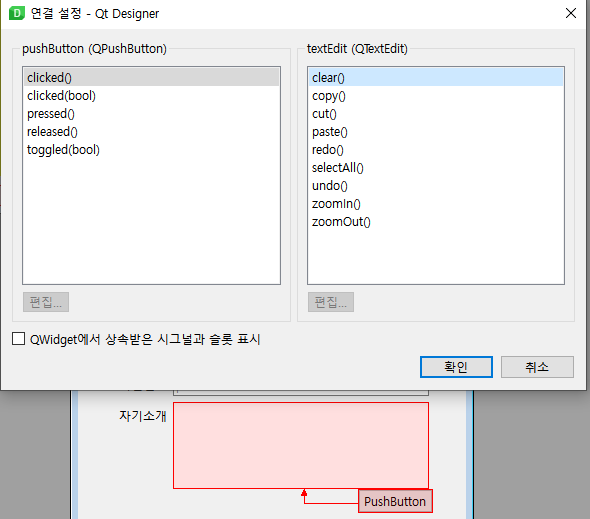

# 03. Dialog

이번 장에서는 Qt Designer 를 통해 대화상자 (다이얼로그, dialog)를 다뤄본다.

대화상자는 새 Form 에서 선택할 수 있으며, 기본 버튼이 있는 형태를 지정할 수 있다.


### 실습 : 회원 가입

간단히 이름, 생년월일, 아이디, 비밀번호, 자기소개 정보를 받을 수 있는 대화상자를 아래와 같이 구현해보자.

- 비밀번호의 경우, Line Edit 를 활용하는 것은 동일하지만 echoMode 를 Password 로 설정하면 됨

- 효과적인 배치를 위해 Form Layout 활용을 실습해보자


- 대화상자도 창과 마찬가지로 UI파일을 그대로 불러오거나, UIC를 활용하여 python 코드로 바꾸어 활용할 수 있다.


### 입력 위젯의 Tab 순서

입력 위젯에서 다음 입력 위젯으로 넘어갈 때 Tab 키를 주로 활용한다. 이때 탭 순서를 미리 지정해줌으로서 대화 상자의 사용성을 개선할 수 있다.


### Built-in Signal 과 Slot 연결하기

Qt Designer를 사용하여 내장 신호와 슬롯을 연결할 수 있습니다. 대화 상자에서 두 위젯 간에 신호와 슬롯 연결을 설정하려면 먼저 Qt Designer의 Edit Signals/Slots 모드로 전환해야 한다. (F4키)

> 복습 <br>
Event : 사용자의 동작<br>
Signal : 동작이 발생할 때 생기는 신호<br>
Slot : 신호를 감지할 때 실행되는 method<br>

1. 자기소개의 textEdit 아래에 버튼을 하나 추가한 뒤, F4 를 눌러 Signals/Slots 모드로 전환한다.

2. 버튼을 누른 후 textEdit 으로 드래그앤드롭한다.

3. 아래와 같이 설정창이 표시된다.



4. 왼쪽이 버튼을 클릭했을 때 발생하는 내장 신호이고, 우측은 이에 따라 대응되는 textEdit 의 method 들이다.
    - clicked() 와 clear() 를 선택한다.

5. Ctrl+R 을 눌러서 실제로 버튼을 눌렀을 때, textEdit 의 내용이 삭제되는지 체크한다.

6. Qt Designer 의 기본 템플릿을 사용하면 accepted 의 신호가 다이얼로그의 accept 와 연결되어있음을 알 수 있다.


---

### 코드 연결

Dialog 를 python 코드로 변환하여 같은 폴더 내 sampleDialog.py 로 저장한다.

그 후 아래 코드를 작성한다. 메인 창에 버튼 하나를 추가하고, 그 버튼을 누를 때 지금까지 작성한 Dialog 를 표시하는 코드이다.

```python
import sys
from PySide6.QtWidgets import QApplication, QDialog, QMainWindow, QPushButton
from sampleDialog import Ui_Dialog

class Window(QMainWindow):

    def __init__(self, parent=None):
        super().__init__(parent)
        self.centralWidget = QPushButton("Join...")
        self.centralWidget.clicked.connect(self.onJoinBtnClicked)
        self.setCentralWidget(self.centralWidget)

    def onJoinBtnClicked(self):
        dlg = JoinDlg(self)
        dlg.exec()


class JoinDlg(Ui_Dialog, QDialog):

    def __init__(self, parent=None):
        super().__init__(parent)
        self.setupUi(self)

app = QApplication(sys.argv)
w = Window()
w.show()
app.exec()

```

아래와 같은 방식으로 ui 파일을 그대로 로드하는 것도 가능하다.

```python
import sys
from PySide6.QtWidgets import QApplication, QDialog, QMainWindow, QPushButton
from PySide6.QtUiTools import QUiLoader

loader = QUiLoader()

class Window(QMainWindow):
    def __init__(self, parent=None):
        super().__init__(parent)
        self.centralWidget = QPushButton("Join...")
        self.centralWidget.clicked.connect(self.onJoinBtnClicked)
        self.setCentralWidget(self.centralWidget)

    def onJoinBtnClicked(self):
        dlg = loader.load("dialog.ui", None)
        dlg.exec()

app = QApplication(sys.argv)
w = Window()
w.show()
app.exec()
```

