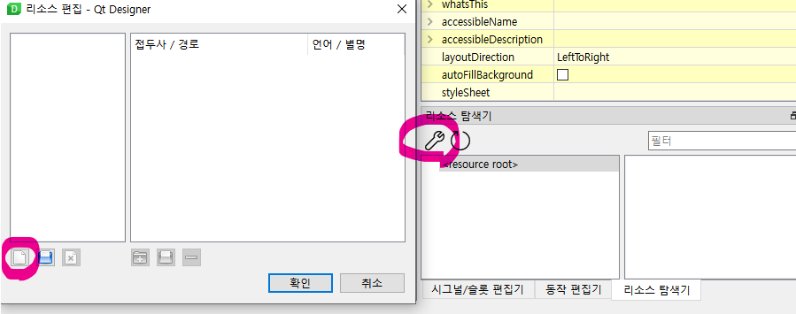
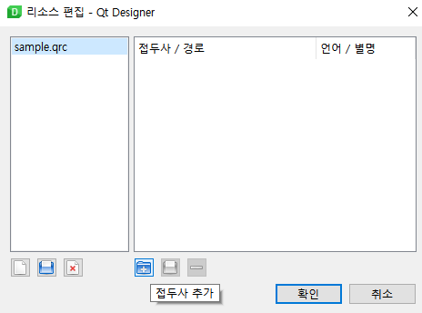
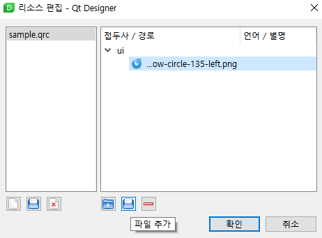
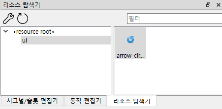
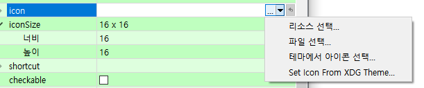
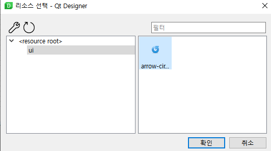
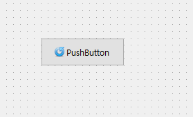

# 04. QResource System

애플리케이션을 빌드하는 데는 코드 외에도 많은 것이 필요하다. 예를 들어 동작에 대한 아이콘이 필요하고, 일러스트레이션이나 브랜딩 로고가 추가될 수 있으며, 애플리케이션에서 위젯을 미리 채우기 위해 데이터 파일을 로드해야 할 수도 있다. 이러한 파일은 애플리케이션의 소스 코드와 별개이지만 궁극적으로 작동하려면 함께 패키징하고 배포되어야 한다.

이번 장에서는 이러한 resource 파일들을 관리하는 시스템에 대해 살펴본다.

> **참고** https://p.yusukekamiyamane.com/ 에서 개인 학습용으로 무료 아이콘을 다운받아서 활용할 수 있다.

### 리소스 탐색기

리소스 탐색기는 Qt Designer 의 우측 하단에 위치해있다.

편집 버튼을 누르고, 새 리소스 파일을 추가한다.

프로젝트 폴더 내 적절한 위치를 지정하고 리소스 파일명을 입력하여 새 리소스 파일을 추가한다.

이제 입력한파일명.qrc 로 리소스가 관리된다. 이제 실제로 이미지 등의 리소스를 받기 위해 오른쪽 창에 접두사 추가를 누른다. 접두사는 ui, icon, image, data 등 필요에 맞게 이름을 설정한다.

다음으로 파일 추가 버튼을 눌러서 해당 접두사/경로 아래에 파일을 불러온다. 

아래처럼 파일이 잘 불러와지는지 체크한다.

---

### 리소스의 형태로 아이콘 추가하기

버튼 하나를 선택한 후 Icon 속성을 찾는다.

화살표를 눌러서 서브메뉴를 열고 리소스를 선택한다.

그러면 다음과 같이 아이콘이 추가된 것을 확인할 수 있다.

마찬가지로 그림을 추가하고 싶을 때에는, Label 의 pixmap 을 동일하게 설정하면 된다. 

