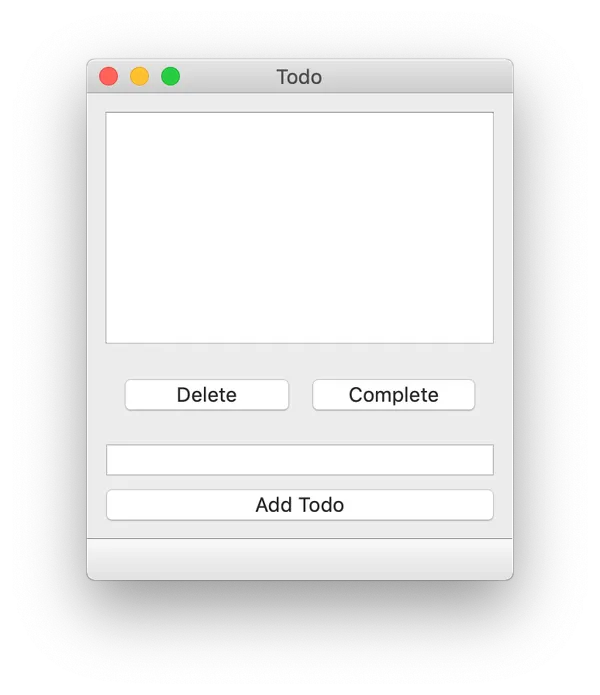
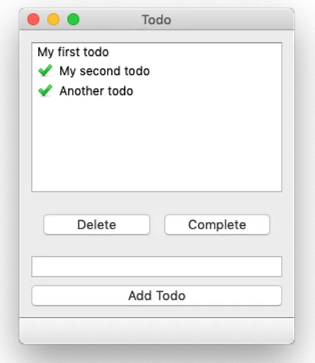

# 02. ModelView Architecture

Qt 를 활용해서 복잡한 애플리케이션을 만들기 시작하면, 위젯과 데이터 사이의 동기화에 복잡성 역시 가중되어 문제가 생길 가능성이 높다. ListWidget 에 저장된 데이터는 python 에서 쉽게 조작하기 어렵다. 항목을 매번 가져오고, 처리한 다음 다시 위젯에 보내고 적용해야하는 과정을 거쳐야하기 때문이다. 따라서, 사용자가 보는 뷰를 데이터와 분리하여 보다 효과적으로 코드 구조를 가져가는 법을 Todo List 앱을 개발해보면서 다뤄본다.

### 모델-뷰-컨트롤러 (MVC) 아키텍처

사용자 인터페이스를 개발하는 데 사용되는 아키텍처 패턴으로, 애플리케이션을 세 개의 상호 연결된 부분으로 나눈다. 특히, 데이터의 내부 표현과 사용자에게 정보를 제공하고 받는 방식을 분리합니다.

- 모델 : 앱이 작업하는 데이터의 구조
- 뷰 : 사용자에게 표시되는 정보의 표현, 동일 데이터 모델에서 여러 뷰를 그려낼 수 있다.
- 컨트롤러 : 사용자로부터 입력을 받은 후 모델이나 뷰에 대한 명령으로 변환하는 작업

Qt 에서는 뷰와 컨트롤러의 구분이 조금 모호한 측면이 있다. 컨트롤러의 부분을 위젯(뷰)에게 위임하기 때문이다. 따라서 Qt에서는 뷰와 컨트롤러를 합쳐서 Model-ViewController 아키텍처로 부른다. (생략해서 모델-뷰 아키텍처라고도 부른다)


### Todo List 앱

#### UI 구성

아래와 같이 UI를 구성한다.
- QListView : 현재 할 일 목록을 표시 (todoView)
- QLineEdit : 새로운 할 일의 텍스트 입력 (todoEdit)
- QPushButton : 새로운 할 일을 목록에 추가 (addButton)
- QPushButton : 현재 선택된 할일을 삭제 (deleteButton)
- QPushButton : 현재 선택된 작업을 완료로 표시 (completeButton)



#### 모델

모델은 데이터를 담당하므로, 할 일과 할 일의 완료상태를 다루어야 한다.

(bool, str) 이 기본 형태로 List 형태로 저장한다. 예를 들면, 아래와 같다.

```python
todos = [(False, 'an item'), (False, 'another item')]
```

QListView 에 대응되는 모델으로 QtCore.QAbstractListModel 클래스를 상속 받아서 모델을 만드는 코드이다.

```python
class TodoModel(QtCore.QAbstractListModel):
    def __init__(self, *args, todos=None, **kwargs):
        super(TodoModel, self).__init__(*args, **kwargs)
        self.todos = todos or []

    def data(self, index, role): # todo 의 조회
        if role == Qt.DisplayRole: # 요청의 역할을 정의하는 flag 변수
            status, text = self.todos[index.row()]
            return text

    def rowCount(self, index): # todo 의 갯수
        return len(self.todos)
```

- `__init__` 메서드는 TodoModel 객체가 생성될 때 호출됨.
- todos 파라미터는 초기 To-Do 리스트 항목을 받을 수 있도록 되어 있음. 기본값으로는 빈 리스트([])가 사용됨
- `super(TodoModel, self).__init__(*args, **kwargs)`는 부모 클래스의 초기화 메서드를 호출하여 상속받은 클래스의 초기화를 수행함
- `self.todos`는 To-Do 항목들을 저장하는 리스트로, todos가 제공되지 않으면 빈 리스트로 초기화됨
- role : 요청할 데이터의 타입과 연관되어 있음
    - Qt.DisplayRole : 텍스트로 렌더링될 데이터 (QString)
    - Qt.DecorationRole : 이미지나 아이콘 형태로 렌더링될 데이터 (QColor, QIcon, QPixmap)
    - Qt.EditRole : 편집기에서 편집하기에 적합한 형태의 데이터(QString)
    - Qt.ToolTipRole : 툴팁에 표시되는 데이터 (QString)
    - Qt.StatusTipRole : 상태표시줄에 표시되는 데이터(QString)
    - Qt.SizeHintRole : 뷰의 항목 크기에 대한 힌트 (QSize)

다음으로는 MainWindow 를 구현해보자. 중요한 것은 Ui_MainWindow 를 상속(서브클래싱)해야하고 todoView 를 모델과 연결하는 것이다. 

```python
class MainWindow(QtWidgets.QMainWindow, Ui_MainWindow):
    def __init__(self):
        super().__init__()
        self.setupUi(self)
        self.model = TodoModel()
        self.todoView.setModel(self.model) # 연결!

app = QtWidgets.QApplication(sys.argv)
window = MainWindow()
window.show()
app.exec()
```

MainWindow 내부에 `self.model = TodoModel()` 부분에서 TodoModel 항목을 아래처럼 추가한다면 초기값이 배정된 것을 확인할 수 있다.

```python
self.model = TodoModel(todos=[(False, 'my first todo')])
```

#### add 기능

UI 에서 할 일을 추가하는 add 함수를 아래처럼 추가한다. 그리고 add 함수를 실제 버튼 클릭 신호와 연결한다.


```python
class MainWindow(QtWidgets.QMainWindow, Ui_MainWindow):
    def __init__(self):
        QtWidgets.QMainWindow.__init__(self)
        Ui_MainWindow.__init__(self)
        self.setupUi(self)
        self.model = TodoModel()
        self.todoView.setModel(self.model)
        self.addButton.pressed.connect(self.add) # Connect the button.

    def add(self):
        text = self.todoEdit.text()
        if text: # 공백 string 을 추가하지 않기 위해
            self.model.todos.append((False, text))
            self.model.layoutChanged.emit() # UI 를 새로고침함
            self.todoEdit.setText("") # 추가하고 나서 입력칸 공백처리
```

`self.model.layoutChanged.emit()` 은 뷰 전체의 새로고침을 trigger 한다. 이 line 을 생략해버리면 todo 는 프로그램 상으로는 추가되지만 UI 에 노출이 되지 않는다 (모델만 동작하고, 뷰에서는 보이지 않음)

#### 그 외 기능 (삭제, 완료)

먼저 버튼과 신호를 `__init__` 에 연결한다.

```python
        self.deleteButton.pressed.connect(self.delete)
        self.completeButton.pressed.connect(self.complete)
```

delete 와 complete method 를 정의한다.

```python
    def delete(self):
        indexes = self.todoView.selectedIndexes()
        if indexes:
            index = indexes[0]
            # Remove the item and refresh.
            del self.model.todos[index.row()]
            self.model.layoutChanged.emit()
            self.todoView.clearSelection()

    def complete(self):
        indexes = self.todoView.selectedIndexes()
        if indexes:
            index = indexes[0]
            row = index.row()
            status, text = self.model.todos[row]
            self.model.todos[row] = (True, text) # True 로 변경
            # 데이터만 변경되고, 전체 행/열의 수 영향을 받지 않는다면 layoutChanged 대신 dataChanged 쓸 수 있음 
            self.model.dataChanged.emit(index, index)
            self.todoView.clearSelection()
```

### Qt.DecorationRole 사용

지금까지 기본적은 todo list 앱을 구현하였는데, 하나 빠진 것이 있다면 완료 상태일 때에 대한 표시이다.

항목을 추가할 때, Qt.DisplayRole 을 활용하였는데 이번에는 Qt.DecorationRole 을 활용하여 완료된 todo 항목에 아이콘을 추가해보자.

```python
tick = QtGui.QImage('tick.png')

class TodoModel(QtCore.QAbstractListModel):
    def __init__(self, *args, todos=None, **kwargs):
        super(TodoModel, self).__init__(*args, **kwargs)
        self.todos = todos or []

    def data(self, index, role):
        if role == Qt.DisplayRole:
            _, text = self.todos[index.row()]
            return text

        if role == Qt.DecorationRole: #icon 데코레이션
            status, _ = self.todos[index.row()]
            if status:
                return tick

    def rowCount(self, index):
        return len(self.todos)
```

어떤 역할일 때, 무엇을 리턴하는지에 따라 자동으로 UI에 반영된다.

여기까지 수행하면 아래와 같은 상태를 만들 수 있다.



---

### 데이터의 저장

방금까지 만든 앱의 동작은 완벽하지만, 치명적인 결함이 하나 있다. 앱을 닫는 순간 모든 todo list 는 사라진다는 것이다. 

이 것을 해결하기 위해 애플리케이션이 꺼져도 todo list 를 저장할 수 있는 데이터 저장소를 구현하는 것이다. 2가지 방법을 사용할 수 있다.
- 파일 : JSON, CSV 형식의 파일로 만든다. 간단한 앱의 경우
- 데이터베이스 : MySQL 등 DBMS 를 활용한다. 데이터의 구조가 복잡하거나, 동시에 접근되는 일이 많아서 안정성이 필요할 때

이번 예제에서는 간단히 JSON 파일로 todo list 를 저장하고, 불러오는 기능을 구현해본다.

```python
    def load(self):
        try:
            with open('data.json', 'r') as f:
                self.model.todos = json.load(f)
        except Exception:
            pass

    def save(self):
        with open('data.json', 'w') as f:
            data = json.dump(self.model.todos, f)
```

위처럼 method 를 구현한 뒤, 상태를 저장할 필요가 있는 모든 부분에 `self.save()` 를 추가한다. 예를 들어, add, delete, complete 모두 해당된다.

`self.load()` 는 생성자 부분에 추가될 필요가 있다. 

