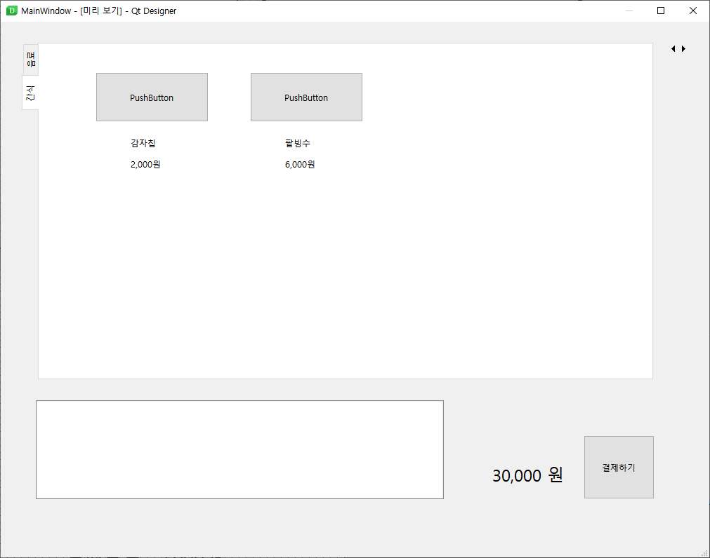
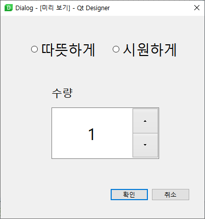
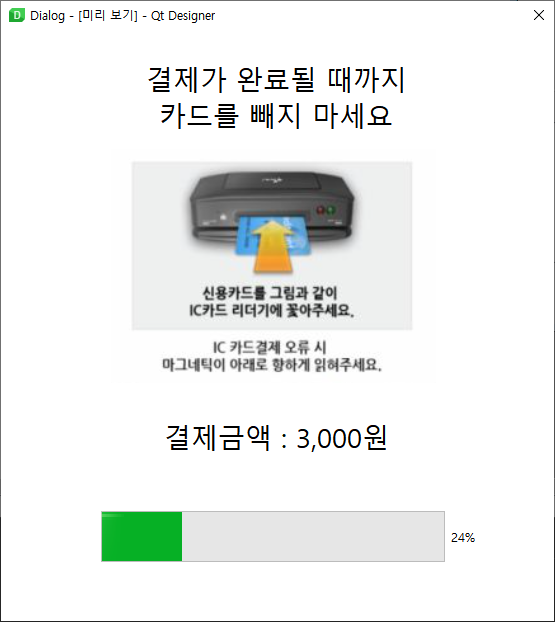

# 03. QStackedWidget

키오스크 환경에서는 새 창이 뜨기보다는 한 화면에서 처리됨.

Stacked Widget 을 통해, 필요한 페이지를 노출시켜주고 나머지는 숨기는 방식으로 주로 구현한다.

setCurrentIndex method 를 사용하면 stacked 되어있는 page 를 띄우는 것이 가능하다.

```python
    def fnc_btn_1(self):
        self.stack.setCurrentIndex(1)  
```


### 실습

실제 키오스크처럼 구현 연습해보기

권장 : 추가적인 UI 를 개선해보면서 실습해보세요


메인화면
- stacked widget 의 page 를 옮기는 버튼은 실제 구동 시에는 보이지 않음



옵션 다이얼로그




결제 다이얼로그



